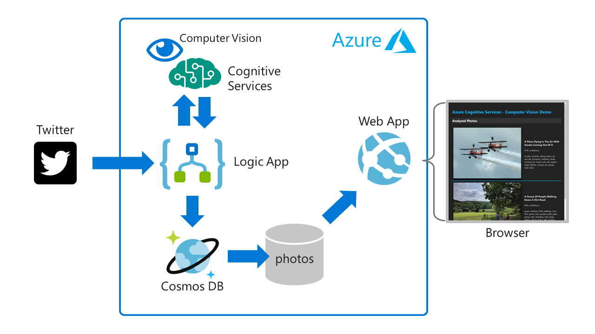

# Cognitive Services Lab

*Modified from orignial repo - https://github.com/benc-uk/serverless-cosmos-lab
*Credit to Jacob Foss for updating the lab

This is a hands on lab guide for Azure. In this lab you will deploy a serverless application which uses Azure Cognitive Services to analyze photos gathered from twitter. An Azure Logic App drives the process and carries out most of the tasks. 

The Logic App flow is:
- Calls the Twitter API and searches for tweets containing a certain hashtag
- Calls the Azure cognitive service API for each photo and gets the result which is a description of the contents of the photo
- Stores the result in Azure Cosmos DB

The Azure cognitive service uses a pre-trained computer vision model to return results describing the image as a JSON object. Cosmos DB is a No-SQL database, which the Logic App uses to store the results as JSON documents, one for each photo result.

The final part of the application is a simple web app, written in Node.js. This web app is hosted in Azure as an Web App Service, it connects to Cosmos DB and displays the photo analysis results as a simple web page.

The guide steps through deploying and configuring the complete end to end solution in Azure

# Solution Architecture

# High Level Steps
1. Create a new resource group
2. Create a Computer Vision API account
3. Create a new Cosmos DB account
4. Create a database and collection in Cosmos DB
5. Create a Logic App
6. Connect Logic App to Twitter
7. Connect Logic App to Cosmos DB 
8. Test and verify
9. Create a new Web App
10. Connect Web App to Cosmos DB
11. View results :)

**************
1.	Create a resource group for all your resources. 
2.	In your resource group add a Computer Vision API. 
3.	Provide the CV a name, location, free pricing tier and the resource group we created prior. 
4.	Click Create. 

In the computer vision resource, we need to copy some information to a notepad as we will need them later. 
1.	Go to the CV resource
2.	In the overview copy the endpoint to a notepad
3.	In the Keys menu, copy the key to the notepad

In our resource group we will add a cosmosDB
1.	Select the resource group 
2.	Give the cosmosdb a global unique name
3.	The API we use in this lab is Core (SQL)
4.	Set the Location
5.	Georedundancy and multi region is not necessary in this lab
6.	Click create

Time for a coffee while deployment is running. When the CosmosDB is deployed we need to copy some information again. 
1.	Copy the URI and the keys to the notepad 
2.	In the data explorer, create a database and collection, in the code I used “mydb” and “photo”
3.	Set the partition key to /user
4.	Keep the RU to 400

